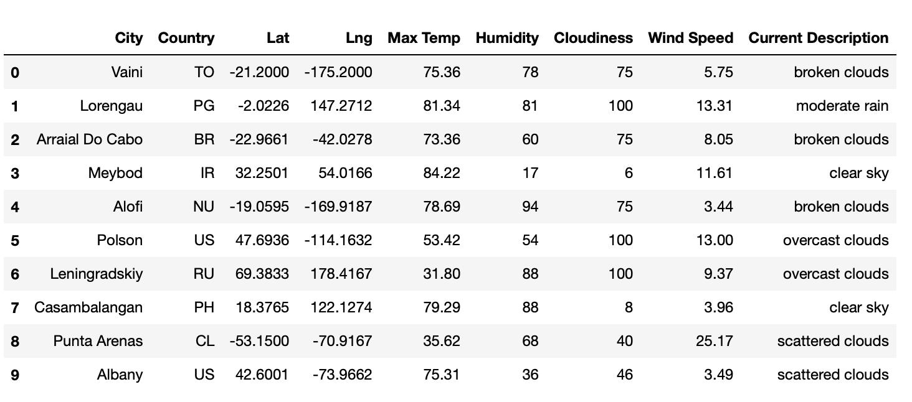
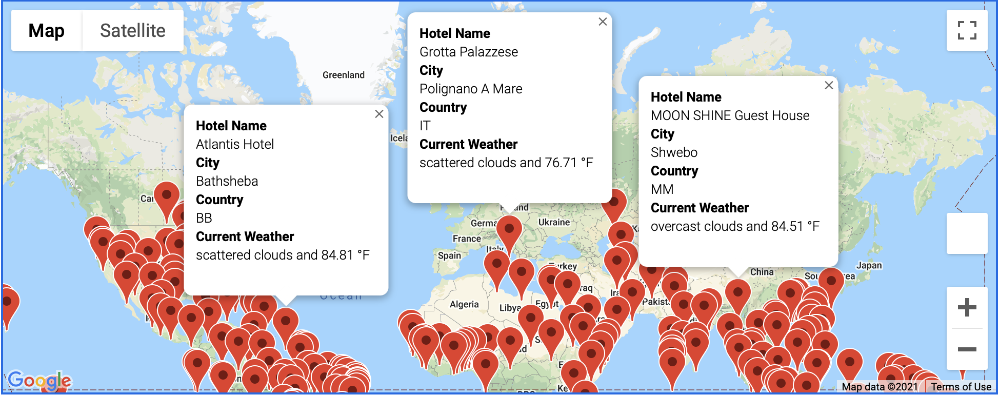
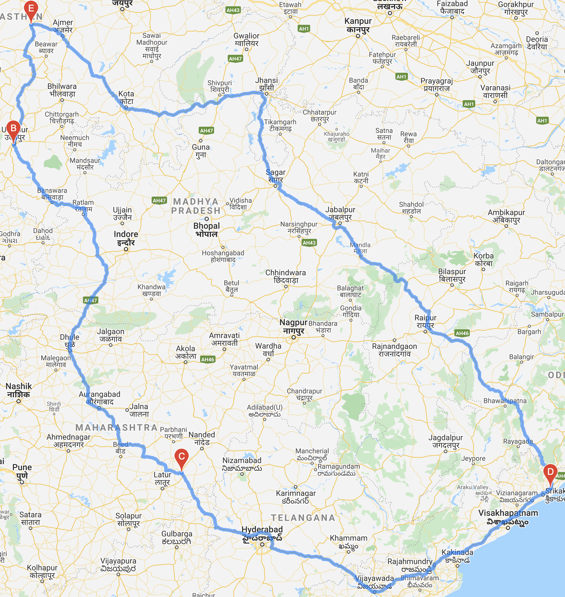
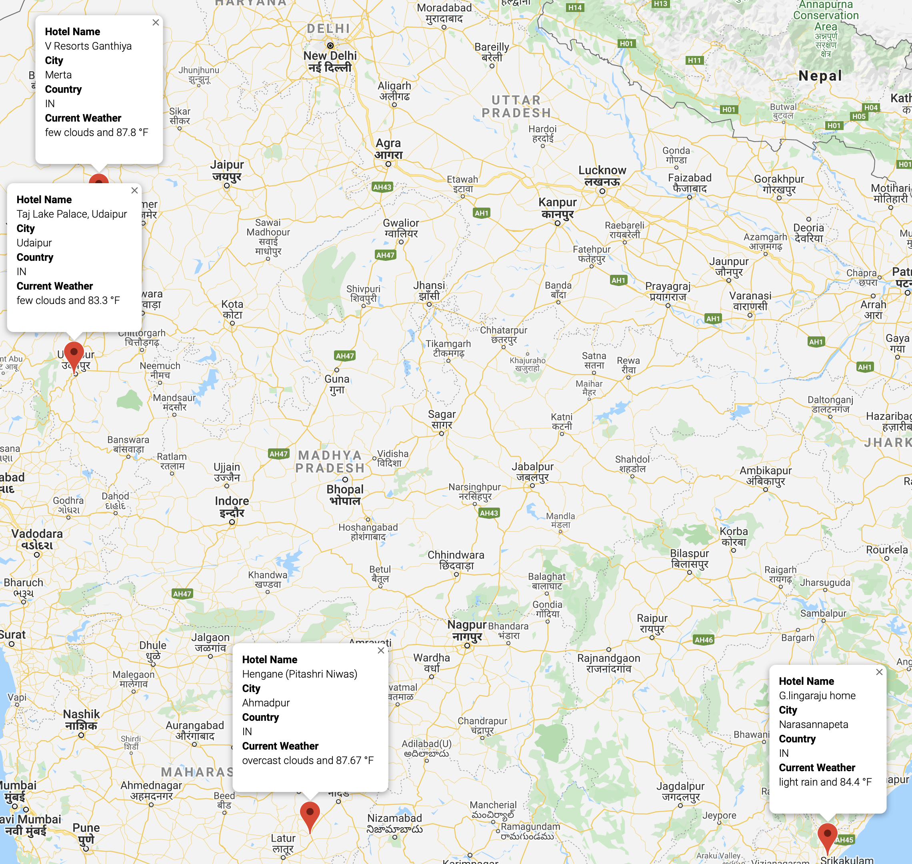

# World_Weather_Analysis

## Overview of project

In this project, collection and analysis of weather data across various cities worldwide for a travel technology company, PlanMyTrip, has to be performed. The collected data should then be presented to customers via search page which is going to be filtered by them based on their preferred travel criteria for finding their ideal hotel anywhere around the world.

### Purpose

The purpose of this project is to use Jupyter notebook and CityPy module to get the cities for more than 500 random latitudes and longitudes by performing requests on  weather map APIs and retrieving weather data from those cities. In addition to collection and analysis of weather data, travelers will be provided with an option that will allow them to filter data based on their weather preferences to be able to identify their travel destinations and nearby hotels and then choosing four different cities to create a travel itinerary. As a result, a travel route between the chosen cities with the use of Google Maps Directions API and marker layer map has to be created.

## Resources

- Python: CitiPy module, Python requests, APIs, JSON Traversals, Pandas Library.

- Jupyter Notebook Files: [Weather_Database.ipynb](Weather_Database/Weather_Database.ipynb), [Vacation_Search.ipynb](Vacation_Search/Vacation_Search.ipynb), [Vacation_Itinerary.ipynb](Vacation_Itinerary/Vacation_Itinerary.ipynb).

## Results

This section of the report focuses on the results achieved in terms of weather databases, vacation search preferences and vacation itinerary for the cities chosen by the  travelers.

### Weather Database

In this part of the project, 2,000 random set of latitudes and longitudes were generated for retrieving the nearest city using CitiPy module. Furthermore, an API call was performed using OpenWeatherMap for retrieving the following weather data for the cities:

- Latitude and Longitude
- Maximum Temperature
- Percent Humidity
- Percent Cloudiness
- Wind Speed
- Weather Description

The retrieved data was then added to a new DataFrame as shown in the figure below and exported as a CSV file.

### Vacation Search

In this part of the project, customer weather preferences were retrieved by allowing the travelers to input their desired maximum and minimum temperature for their trip using input statements. Hence, identifying their potential travel destinations and nearby hotels. As a result, those destinations were plotted and displayed on marker layer map with pop-up markers as illustrated in the figure below.

### Vacation Itinerary

In this portion of the project Google Directions API was utilized for creating travel itinerary and displaying the route between four cities from customer's possible travel destinations.

As a result, a sample directions layer map was created showing the route between four chosen cities in India as demonstrated in the figure below.

Additionally, a marker layer map with a pop-up marker for each city was created as depicted in the figure below.

## Summary

In conclusion, the project was successfully completed by practicing the required statistical and visualization skills with the use of Python CitiPy module, Pandas library, Jupyter notebook, APIs, JSON Traversals and Gmaps platforms for retrieving the required weather data. Thus, helping PlanMyTrip to achieve their goal by implementing additional features to their application. 
